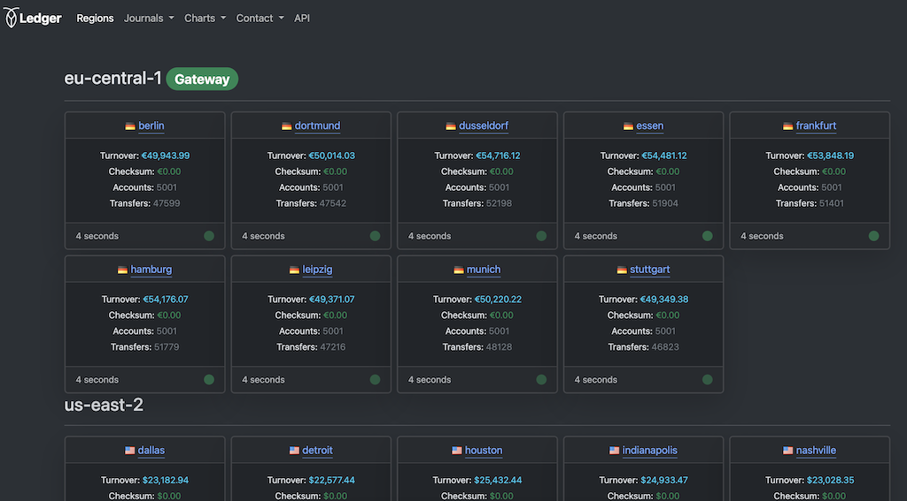
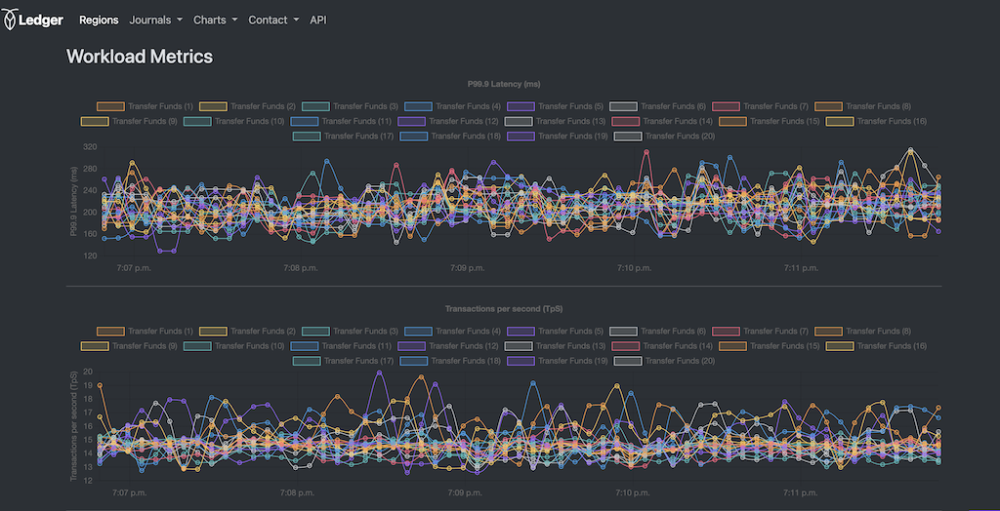

[](https://github.com/kai-niemi/ledger/actions/workflows/maven.yml)

<!-- TOC -->
* [Ledger](#ledger)
  * [Compatibility](#compatibility)
* [Terms of Use](#terms-of-use)
* [Setup](#setup)
  * [Prerequisites](#prerequisites)
  * [Install the JDK](#install-the-jdk)
  * [Database Setup](#database-setup)
    * [CockroachDB Setup](#cockroachdb-setup)
    * [PostgreSQL Setup (optional)](#postgresql-setup-optional)
  * [Building](#building)
    * [Clone the project](#clone-the-project)
    * [Build the artifact](#build-the-artifact)
* [Configuration](#configuration)
* [Running](#running)
  * [Run with an interactive shell](#run-with-an-interactive-shell)
  * [Start in the background](#start-in-the-background)
  * [Enable PostgreSQL](#enable-postgresql)
* [Single-region Tutorial](#single-region-tutorial)
  * [Basics](#basics)
  * [Create an account plan](#create-an-account-plan)
  * [Transfer funds](#transfer-funds)
  * [Read balance](#read-balance)
  * [Create accounts](#create-accounts)
  * [Transfer grants](#transfer-grants)
  * [Workload Overview](#workload-overview)
* [Multi-region Tutorial](#multi-region-tutorial)
<!-- TOC -->

# Ledger

 

Ledger represents a full-stack, financial accounting ledger based on the double-entry
bookkeeping principle, running on either [CockroachDB](https://www.cockroachlabs.com/) or PostgreSQL. It manages monetary 
accounts and a journal of balanced, multi-legged, multi-currency transfers between those accounts. 

It's designed to showcase CockroachDB's scalability, survival, consistency and data domiciling 
capabilities and not the actual domain complexity of accounting. However, it's a realistic 
implementation of a general ledger with most of the fundamental pieces.

Ledger is the successor to [Roach Bank](https://github.com/kai-niemi/roach-bank) with more focus on 
load testing and operational ease-of-use. Conceptually they are the same, but Ledger has a simpler 
design, improved UI and leverages JDK21 features such as virtual threads for better efficiency.





## Compatibility

- CockroachDB v23.2+
- PostgreSQL 9+
- MacOS (main platform)
- Linux
- JDK 21

# Terms of Use

This tool is not supported by Cockroach Labs. Use of this tool is entirely at your
own risk and Cockroach Labs makes no guarantees or warranties about its operation.

See [MIT](LICENSE.txt) for terms and conditions.

# Setup

Things you need to build and run Ledger locally.

## Prerequisites

- Java 21+ JDK
    - https://openjdk.org/projects/jdk/21/
    - https://www.oracle.com/java/technologies/downloads/#java21
- Git
    - https://git-scm.com/downloads/mac
- CockroachDB Cloud or self-hosted 23.2+
- PostgreSQL 9+ (optional)

## Install the JDK

MacOS (using sdkman):

    curl -s "https://get.sdkman.io" | bash
    sdk list java
    sdk install java 21.0 (pick version)  

Ubuntu:

    sudo apt-get install openjdk-21-jdk

## Database Setup

### CockroachDB Setup

See [start a local cluster](https://www.cockroachlabs.com/docs/v24.2/start-a-local-cluster) for setup instructions.

Then create the database, in this case assuming an insecure cluster:

    cockroach sql --insecure -e "create database ledger"

An [enterprise license](https://www.cockroachlabs.com/docs/stable/licensing-faqs.html#obtain-a-license)
is only needed when using geo-partitioning and follower-reads (opt-out features if n/a).

To set an enterprise license:

    cockroach sql --insecure --host=localhost -e "SET CLUSTER SETTING cluster.organization = '...'; SET CLUSTER SETTING enterprise.license = '...';"

### PostgreSQL Setup (optional)

Install on MacOS using brew:

    brew install postgresql

Start PSQL:

    brew services start postgresql@14

Create the database:

    psql postgres
    $ CREATE database ledger;
    $ CREATE extension pgcrypto;
    $ quit

Stop PSQL:

    brew services stop postgresql@14

## Building

Instructions for building the project locally.

### Clone the project

    git clone git@github.com:kai-niemi/ledger.git && cd ledger

### Build the artifact

    chmod +x mvnw
    ./mvnw clean install

Ledger is one single server component (executable jar) now available under`target/`.

# Configuration

All configuration properties can be specified in [config/application-default.yml](config/application-default.yml) that 
overrides the baseline configuration in [src/main/resources/application.yml](src/main/resources/application.yml) 
(see this file for a reference on all options available).

You can also override all parameters through the command line, which is the easiest approach: 

    java -jar ledger.jar \
    --spring.datasource.url="jdbc:postgresql://localhost:26257/ledger??ssl=true&sslmode=require" \
    --spring.datasource.username=craig \
    --spring.datasource.password=cockroach \
    --spring.profiles.active="default"

Alternatively, you can create a new YAML file with a custom name suffix and then pass that
name with the `--profiles` argument:

    cp src/main/resources/application.yml config/application-craig.yml
    java -jar ledger.jar --spring.profiles.active="craig"

# Running

## Run with an interactive shell

Start the server with:

    java -jar target/ledger.jar <args>

(or use `./run-server.sh`).

Now you can access the application via http://localhost:9090.

## Start in the background
              
Add the shell commands you would like to run into a plain text file:

    echo "version" > cmd.txt
    echo "transfer-funds" >> cmd.txt
    echo "read-balance" >> cmd.txt

Start the server in the background by passing a command file name 
as argument with a `@` prefix:

    nohup java -jar target/ledger.jar @cmd.txt > ledger-stdout.log 2>&1 &

(or use `./start-server.sh @cmd.txt`)

The server will run all commands in the text file and then wait to be closed. 
Notice that you can't use `quit` in the end since all commands are run in sequence
but executed in parallel.

## Enable PostgreSQL

PostgreSQL is enabled by activating the `psql` profile:

    java -jar ledger.jar \
    --spring.datasource.url="jdbc:postgresql://localhost:5432/ledger \
    --spring.datasource.username=craig \
    --spring.datasource.password=cockroach \
    --spring.profiles.active="psql"

Ledger automatically adjusts to the dialect of PostgreSQL lack of multi-region 
and follower read features. There's also no concept of gateway nodes, or primary 
and secondary regions so you will need to specify regions on most workload commands.

# Single-region Tutorial

Usage tutorial for running a basic demo or load test towards a single-region 
or single-host CockroachDB cluster.

## Basics

Ledger is operated through its built-in shell, or by a command file passed at startup
time, in which case the shell is disabled (see [running](#running) instructions).
For a complete list of commands, run the `help` command in the shell.

There's also a reactive web UI available at http://localhost:9090 (by default)
to display account activities and different metric charts.

Ledger organizes monetary accounts around cities within regions. A region maps to an 
actual CockroachDB deployment region like `aws-us-east-1`. One region has one or 
more cities, and a city has a country and currency code. This allows for good data 
distribution and simple data partitioning for multi-region scenarios. 

By default it includes all CockroachDB Cloud regions for AWS, GCP and Azure. You can 
also create a custom region/city mapping through the application YAML.

Excerpt from `src/resources/application.yml`:

```yaml
  ...
  application:
      regions:
        - name: us-east-1
          country: USA
          currency: USD
          cities:
            - name: new york
            - name: boston
            - name: washington dc
            - name: miami
            - name: charlotte
            - name: atlanta
        - name: us-east-2
          country: USA
          currency: USD
          cities:
            - name: st louis
            - name: indianapolis
            - name: nashville
            - name: dallas
            - name: houston
            - name: detroit
        ...
      region-mappings:
        aws-us-east-1: us-east-1 #N. Virginia
        aws-us-east-2: us-east-2 #Ohio
        gcp-us-east1: us-east-1 #South Carolina
        gcp-us-east4: us-east-2 #Virginia
        ...
```

## Create an account plan
    
The first step is to build an account plan:

    build-account-plan

This command will create one _liability_ account and 5,000 _asset_ accounts per city, by default. The account plan
is organized in such a way that the total balance of all accounts for a given city (and currency) amounts to zero. 
Thus, if a non-zero total is ever observed it means money has either been invented or destroyed and 
we can't have that *). 

The account plan can be dropped and recreated which is a destructive operation 
since it truncates the tables.

*) You can allow this to happen by running in `read committed` isolation without 
pre-emptive locks. 
      
## Transfer funds

An existing account plan unlocks the different workload commands, such as: 

    transfer-funds

This is the primary read-write workload that transfer funds between asset accounts 
selected by random. It is done by balanced, multi-legged transfers executed 
in parallel. 

One transfer `leg` equals one account balance update, thus the minimum number of 
legs required is two. A balance update can hold a positive or negative value for simplicity, 
rather than a _credit_ or _debit_ in real accounting (which is never negative).

By default, all workloads select the cities in the gateway node's region
(local region to the client). You can however pick any region, or all of them,
affectively starting a transfer workload for every city, like:

    transfer-funds --region all

## Read balance

This workload is purely read-only and executes point lookups on accounts to 
retrieve the current authoritative balance.

    read-balance

Another variant is to use a historical follower read, which, if you are familiar with CockroachDB, 
means that any node receiving a request hosting a range replica for the requested key 
can service the request, at the expense of the returned value being potentially stale 
with up to ~5s (called a _bounded staleness read_). Normally only the lease holder replica
can service reads.

    read-balance-historical

## Create accounts

This is a write-only command to create new asset accounts in batches. It can be used to 
populate the database with more accounts than included in the account plan. 

Notice that these accounts will have a zero balance and are not allowed to go negative. 
To fund these accounts, you need to run the `transfer-grants` command to grant funds 
from liability accounts.

    create-accounts

## Transfer grants

Similar to the `transfer-funds` command, this one will move money from liability accounts to 
asset accounts withing a specified balance range. It's useful to run this after 
creating new accounts to allow these to become part of workload selections.

    transfer-grants
  
## Workload Overview

A quick overview of the main workload commands and the type of SQL transactions they perform.

| Workload                | Reads | Writes | Explicit | Implicit | Locks | Duration |
|:------------------------|-------|--------|----------|----------|:------|:---------|
| transfer-funds          | 20%   | 80%    | x        |          | x     | 120m     |
| transfer-grants         | 10%   | 90%    | x        |          | x     | Finite   |
| create-accounts         |       | 100%   |          | x        |       | 120m     |
| read-balance            | 100%  |        |          | x        |       | 120m     |
| read-balance-historical | 100&  |        |          | x        |       | 120m     |


# Multi-region Tutorial

For the complete multi-region guide, see [tutorial](TUTORIAL.md).

---

-- The end, enjoy your accounting experience!